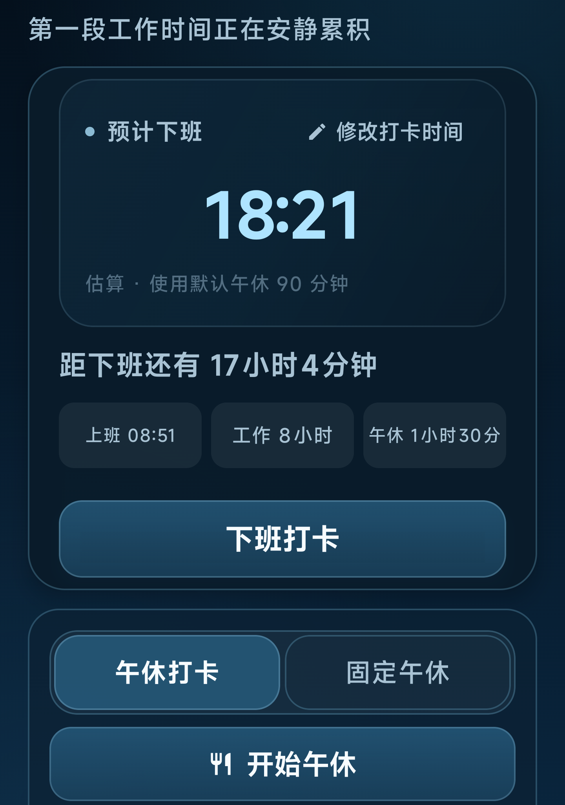
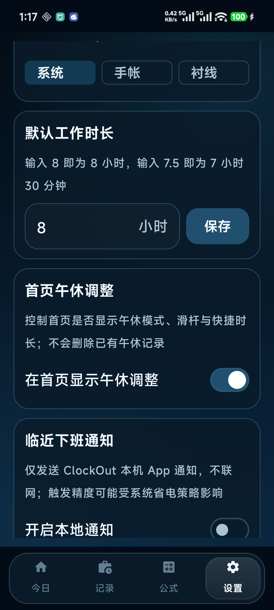

# ClockOut

ClockOut 是一款面向个人使用的原生 Android 工时记录工具，用于记录上班、午休和下班时间，并根据当日规则实时计算预计下班时间、剩余时长与实际工作时长。

当前发布版本：**v2.0.0**。v2 将首页打卡流程改为受控时间输入，并继续保持纯本地、无账号、无联网设计。

应用采用纯本地设计：无需账号、不连接服务器、不申请联网权限，所有记录与设置仅保存在应用私有目录。

## 产品预览（v2.0.0）

以下界面使用「深海」主题，截图来自 Android 真机。首页截图展示 v2 的单区域打卡流程、居中的预计下班时间与 08:30～09:10 打卡时间滑栏；设置截图展示紧凑的圆角工作时长输入框。

<p align="center">
  
  
</p>

## v1 → v2 变更记录

- 首页从“直接使用当前时间打卡”升级为“打卡时间”单区域编辑：支持 `08:30～09:10` 滑栏，以及 `856 → 08:56`、`901 → 09:01` 快速输入。
- 未打卡时只展示打卡时间；完成打卡后同一区域切换为预计下班时间，可随时切回修改打卡时间。
- 新的一天优先参考最近一个工作日的午休时长，没有历史记录时使用设置中的默认午休，并在卡片中标注估算来源。
- 午休模式增加手动输入开始/结束时间，同时保留开始午休、结束午休按钮。
- 固定午休范围调整为 `0～90` 分钟，步长 5 分钟，快捷值为 `0/30/60/90`；已完成历史记录不被强制改写。
- 手动打卡时间拒绝未来时间，午休开始/结束按同日顺序校验，避免误生成跨日记录。
- 深海主题重新调整背景渐变、玻璃层次、描边和强调色；拖动午休滑栏时只更新界面，松手后再保存，减少卡顿。
- Android 前台窗口主动请求设备最高刷新率；最终刷新率仍可能受系统、省电和温控策略影响。
- 临近下班提醒明确为仅发送 ClockOut 本机 App 通知，不使用短信、第三方推送或服务器。

## 1. 产品定义

### 1.1 产品目标

- 用尽可能少的操作完成上班、午休和下班记录。
- 根据工作时长与午休规则，持续给出可信的预计下班时间。
- 支持补录、修改和跨日场景，避免错误记录无法修正。
- 提供清晰的周/月工时回顾与常用机械工程计算工具。
- 在不上传任何个人数据的前提下完成存储、提醒和状态恢复。

### 1.2 目标用户

需要自行记录每日出勤时间、关注预计下班时间，并在工作中使用常见机械公式、单位换算或科学计算器的个人用户。

### 1.3 产品边界

当前 v2 版本不包含登录、账户、云同步、团队协作、企业管理、公共目录导出、第三方统计或任何服务端能力。后续规划见 [docs/ROADMAP.md](docs/ROADMAP.md)。

## 2. 核心使用流程

```text
上班打卡 → 上午工作中 → 午休开始 → 午休结束 → 下午工作中 → 下班打卡 → 今日总结
```

用户也可以将当天标记为休息日，或对上班、午休、下班和工作时长进行补录及修改。任何时间或规则发生变化后，预计下班时间和派生数据都会重新计算。

当天记录保存在本地数据库中。应用被系统杀死、退出或设备重启后，再次打开仍会恢复正确状态；未完成的前一天记录会提示补录，不自动生成下班时间。

## 3. 信息架构

应用采用单 Activity 与底部四栏导航：

| 页面 | 用途 |
| --- | --- |
| 今日 | 打卡、倒计时、午休模式、时间轴和当日编辑 |
| 记录 | 按周或指定日期查看、编辑和删除历史记录 |
| 公式 | 机械工程公式、单位换算和科学计算器 |
| 设置 | 工作规则、提醒、外观、字体、反馈与数据管理 |

## 4. 功能需求

### 4.1 今日

一天包含未上班、上午工作中、午休中、下午工作中、已下班和休息日六种状态。页面始终突出当前阶段最重要的操作，避免同时展示多个竞争按钮。

- 上班打卡：在 `08:30～09:10` 范围内快速输入或滑动选择时间，也支持后续补录和修改；当天不接受未来时间。
- 午休打卡：分别记录午休开始与结束时间，午休进行中展示已休息时长。
- 固定午休：按预设分钟数计算，不要求记录午休起止时间。
- 下班打卡：记录当前时间或手动补录，完成后展示实际工时和时间差。
- 编辑能力：当日时间节点可编辑；历史记录列表支持左滑删除。
- 休息日：当天可标记或取消休息日。
- 防重复：连续点击不会创建重复的每日记录或重复时间节点。

主卡片展示预计下班时间、当前状态、分钟级倒计时与计算依据。例如：

```text
09:03 上班 + 8 小时工作 + 1 小时 30 分钟午休
```

预计时间跨越午夜时使用“次日 01:20”一类文案。倒计时按照分钟级节奏刷新，避免每秒引发整个页面无意义重组。

### 4.2 午休模式

默认使用「午休打卡」，用户可切换为「固定午休」。未选中的模式仍保留清晰边框，保证在浅色和深色主题下均可识别。

固定午休支持 0–90 分钟、5 分钟步长，并提供 0、30、60、90 分钟快捷选项。滑动到刻度时可根据设置提供轻微触觉反馈。

午休打卡支持补录和修改开始、结束时间。结束时间不得早于开始时间；午休未结束时，不生成错误的实际工作时长。

### 4.3 记录

- 默认展示本周（周一至周日）的记录。
- 支持按日期定位并进入单日详情。
- 每日记录卡采用 2 行 × 3 列布局，展示上班、午休开始、午休结束、预计下班、实际下班和今日工时。
- 列表项支持左滑删除，并在删除前二次确认。
- 单日详情支持编辑时间、工作规则和休息日状态。
- 底部常驻显示累计工时；点击后在本周与本月之间切换。
- 累计工时默认以小时显示，可切换为分钟。
- 没有记录时展示完整空状态与明确操作指引。

今日工时按以下定义计算：

```text
今日工时 = 实际下班时间 - 上班时间 - 实际午休时长
```

### 4.4 公式

公式页面作为独立的本地工作工具，包含：

- 22 个常用机械工程公式，覆盖强度、传动、加工、液压与几何等类别。
- 9 类常用单位换算。
- 支持基础运算和常见函数的科学计算器。

公式卡片同时展示中文名称、表达式、输入参数、单位、计算结果和必要的适用说明。所有计算在设备本地完成。

### 4.5 设置

- 自定义默认工作时长，支持 `8`、`7.5` 等自然输入格式。
- 控制首页是否显示午休调整，并设置默认午休时长。
- 设置临近下班本机通知：关闭、提前 5/10/30 分钟、准时或自定义提前分钟数；不联网、不发送第三方推送。
- 开关触觉反馈与 24 小时制。
- 选择银灰、晨雾、深海、暖砂、黑白五套低饱和玻璃主题。
- 选择系统、中文手帐、衬线三套字体风格。
- 查看本地数据与隐私说明、应用版本。
- 删除全部数据；确认后清空数据库、设置、通知和已安排提醒。

Android 13 及以上仅在用户主动开启提醒时申请通知权限。拒绝权限不会影响打卡、记录和计算功能。

## 5. 时间计算规则

### 固定午休

```text
预计下班时间 = 上班时间 + 当日工作时长 + 固定午休时长
```

### 午休打卡进行中

```text
预计下班时间 = 上班时间 + 当日工作时长
             + max(默认午休时长, 当前已午休时长)
```

### 午休打卡结束后

```text
预计下班时间 = 上班时间 + 当日工作时长 + 实际午休时长
```

### 下班打卡后

```text
实际工作时长 = 实际下班时间 - 上班时间 - 实际午休时长
超出预计工作时间 = 实际下班时间 - 预计下班时间
```

所有结果精确到分钟。时间处理基于绝对时间与记录时区，支持跨午夜、日期边界和设备时区变化。历史已完成记录保留其当日工作规则，不因默认设置变化而被覆盖。

## 6. 交互与视觉规范

- 以低饱和黑白灰和自然色为基础，使用半透明渐变、细描边、柔和光晕和层级关系模拟毛玻璃。
- 主卡片 24dp 圆角，普通卡片 20dp 圆角，按钮 18dp 圆角，选项使用全圆角胶囊形态。
- 重要数字保持明显层级，同时兼顾系统字体放大后的可读性。
- 所有主题分别定义背景、卡片、正文、次级文字、按钮和弹窗颜色，保证足够对比度。
- 可点击区域不小于 48dp，并为关键操作提供 TalkBack 语义。
- 页面、卡片、数字和选中状态使用约 200–350ms 的轻量 Compose 动效。
- 系统减少动态效果时，降低或关闭非必要位移、缩放与装饰动画。

## 7. 数据与隐私

- 不登录、不注册，不连接服务器。
- Manifest 不申请联网权限。
- 不包含广告、统计、埋点或崩溃上报 SDK。
- Room 数据库与 DataStore 设置仅位于应用私有目录。
- 不向公共存储写入记录，不提供外部数据导出。
- 禁止 Android 云备份与设备迁移备份。
- `usesCleartextTraffic=false`。
- 卸载应用后，私有数据随应用一同删除。
- “删除全部数据”会清空 Room、DataStore、通知和提醒任务，重新打开应用不会恢复已删记录。

完整说明见 [docs/PRIVACY.md](docs/PRIVACY.md)。

## 8. 技术方案

| 项目 | 方案 |
| --- | --- |
| 语言 | Kotlin |
| UI | Jetpack Compose、Material 3 |
| 架构 | 单 Activity、Compose Navigation、ViewModel |
| 数据 | Room、Preferences DataStore |
| 异步状态 | Kotlin Coroutines、Flow |
| 时间处理 | `java.time` |
| 本地提醒 | WorkManager |
| 最低系统 | Android 8.0 / API 26 |
| 编译与目标版本 | API 35 |
| 构建环境 | Gradle Wrapper、JDK 17 |

业务计算集中在 `WorkTimeCalculator`，与 Compose 界面分离，便于独立测试时间规则和异常场景。

## 9. 构建与安装

环境要求：JDK 17、Android SDK Platform 35、Android Build Tools 35.0.0。

```bash
export JAVA_HOME=/path/to/jdk-17
export ANDROID_SDK_ROOT=/path/to/android-sdk
./gradlew testDebugUnitTest lintDebug assembleDebug
```

Debug APK 输出路径：

```text
app/build/outputs/apk/debug/app-debug.apk
```

连接 Android 设备后安装：

```bash
adb devices
adb install -r app/build/outputs/apk/debug/app-debug.apk
```

## 10. 提醒精度说明

下班提醒由 WorkManager 持久化调度，应用进程退出或设备重启后可根据有效记录恢复。Android 的省电、待机机制以及不同厂商的后台策略可能推迟任务执行，因此提醒不保证达到闹钟级精度。

## 11. 验收标准

- 上班、午休和下班的主流程可在当前时间打卡、补录、编辑与撤销之间闭环。
- 固定午休、午休打卡、跨日和时区边界的计算结果正确。
- 历史记录可恢复、按日期查看、编辑、左滑删除并统计周/月工时。
- 删除全部数据后，重启应用不再出现已删除记录，旧通知与提醒不再触发。
- 通知权限被拒绝时，其余功能保持可用。
- 四个主页面在五套主题和三种字体下保持文字清晰、操作可辨识。
- 单元测试、静态检查和 Debug 构建均可通过。

当前 v2 工程基线：31 项单元测试通过，`lintDebug` 为 0 errors，Debug APK 构建成功，并已在小米 2410DPN6CC 真机运行。设备支持 120Hz，ClockOut 前台请求最高刷新率；滚动测试主要帧错过率约 0.24%。

## 12. 项目文档

- [隐私说明](docs/PRIVACY.md)
- [后续路线图](docs/ROADMAP.md)
- [中文手帐字体许可证](docs/licenses/OFL-MaShanZheng.txt)

中文手帐字体使用 [Ma Shan Zheng](https://fonts.google.com/specimen/Ma+Shan+Zheng)，按 SIL Open Font License 1.1 随应用分发。

## 许可说明

ClockOut 当前作为个人项目维护。除 `docs/licenses` 中单独列出的第三方字体许可外，项目代码暂未声明开源许可证。
